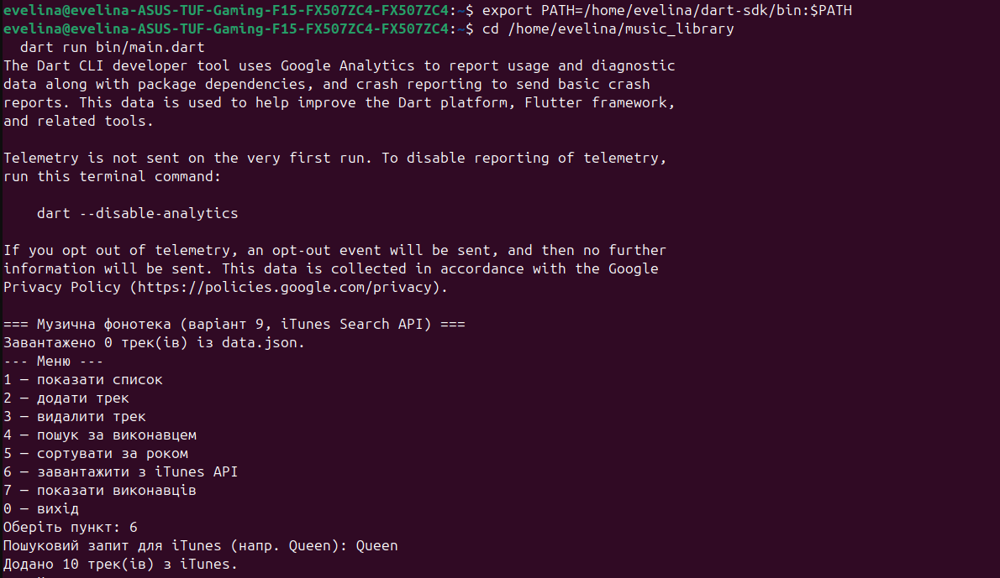
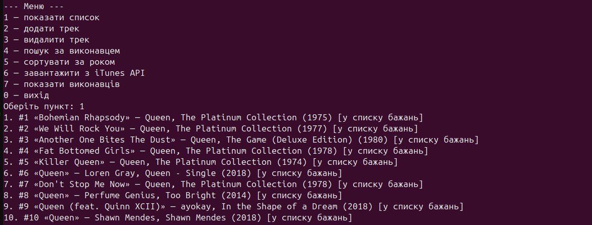
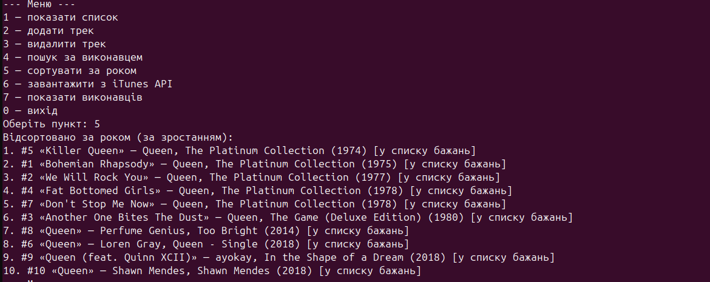
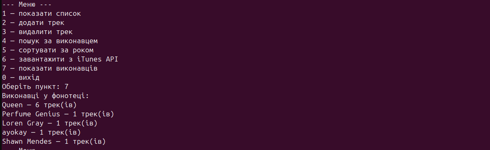
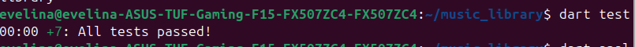
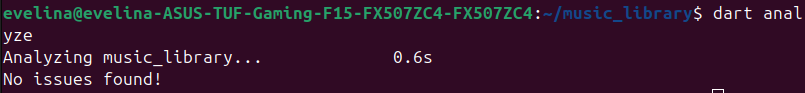

# Звіт до лабораторної роботи

## Консольний застосунок мовою Dart: музична фонотека

**Дисципліна:** Кросплатформенне програмування (викл. Кавара А.О.)
**Варіант 9:** Музична фонотека — джерело даних **iTunes Search API**
**Виконала:** студентка 4 курсу групи ІПЗ-42 Ткачук Евеліна · Луцьк 2026

---

## 1. Мета роботи
Навчитися створювати консольний застосунок мовою Dart: описувати предметну область класами,
отримувати дані з відкритого REST API, зберігати їх у файл формату JSON та відновлювати під час
наступного запуску. Варіант 9 — музична фонотека; джерело даних — iTunes Search API.

## 2. Структура проєкту
```
music_library/
├── bin/main.dart                     — точка входу, текстове меню
├── lib/
│   ├── models/
│   │   ├── storable.dart             — абстрактний інтерфейс (toJson)
│   │   ├── track.dart                — модель треку (основна)
│   │   ├── artist.dart               — модель виконавця (повʼязана)
│   │   └── track_status.dart         — enum статусу треку
│   ├── services/itunes_service.dart  — звернення до iTunes API
│   └── repositories/track_repository.dart — читання/запис data.json
├── test/                             — модульні тести (7 шт.)
├── pubspec.yaml                      — залежності (http, test)
└── README.md
```

## 3. Лістинг основних класів

### Абстрактний інтерфейс `Storable` (реалізують обидві моделі)
```dart
/// Базовий інтерфейс для будь-якого обʼєкта предметної області,
/// який можна серіалізувати у JSON. Реалізують обидві моделі — Track і Artist.
abstract class Storable {
  Map<String, dynamic> toJson();
}
```

### Перелічення `TrackStatus` (довідникове поле)
```dart
/// Довідникове поле: статус треку в особистій фонотеці.
enum TrackStatus { wishlist, listening, favorite }

extension TrackStatusX on TrackStatus {
  /// Людиночитабельна назва статусу для консольного виводу.
  String get label => switch (this) {
    TrackStatus.wishlist => 'у списку бажань',
    TrackStatus.listening => 'слухаю',
    TrackStatus.favorite => 'улюблене',
  };

  /// Відновлення значення enum за назвою (з JSON); за замовчуванням — wishlist.
  static TrackStatus fromName(String? name) => TrackStatus.values.firstWhere(
    (s) => s.name == name,
    orElse: () => TrackStatus.wishlist,
  );
}
```

### Модель `Track` (toJson / fromJson / розбір відповіді API)
```dart
import 'storable.dart';
import 'track_status.dart';

/// Основна модель предметної області — трек музичної фонотеки.
class Track implements Storable {
  final int id;
  final String title;
  final String artist;
  final String album;
  int year;
  TrackStatus status;

  Track({
    required this.id,
    required this.title,
    required this.artist,
    required this.album,
    required this.year,
    this.status = TrackStatus.wishlist,
  });

  @override
  Map<String, dynamic> toJson() => {
    'id': id,
    'title': title,
    'artist': artist,
    'album': album,
    'year': year,
    'status': status.name,
  };

  /// Фабричний конструктор для розбору запису з файла data.json.
  factory Track.fromJson(Map<String, dynamic> json) => Track(
    id: json['id'] as int,
    title: json['title'] as String,
    artist: json['artist'] as String,
    album: json['album'] as String,
    year: json['year'] as int,
    status: TrackStatusX.fromName(json['status'] as String?),
  );

  /// Фабричний конструктор для елемента відповіді iTunes Search API.
  factory Track.fromItunes(Map<String, dynamic> json) => Track(
    id: json['trackId'] as int? ?? 0,
    title: json['trackName'] as String? ?? 'Без назви',
    artist: json['artistName'] as String? ?? 'Невідомий виконавець',
    album: json['collectionName'] as String? ?? '—',
    year: DateTime.tryParse(json['releaseDate'] as String? ?? '')?.year ?? 0,
  );

  @override
  String toString() =>
      '#$id «$title» — $artist, $album ($year) [${status.label}]';
}
```

### Сервіс `ItunesService` (http.Client через конструктор — для MockClient у тестах)
```dart
import 'dart:convert';

import 'package:http/http.dart' as http;

import '../models/track.dart';

/// Сервіс звернення до зовнішнього iTunes Search API.
///
/// http.Client приймається через конструктор, щоб у тестах можна було
/// підставити MockClient і перевірити розбір відповіді без реального запиту.
class ItunesService {
  final http.Client _client;

  ItunesService({http.Client? client}) : _client = client ?? http.Client();

  /// Пошук треків за запитом. Кидає Exception, якщо статус відповіді ≠ 200.
  Future<List<Track>> searchTracks(String term, {int limit = 10}) async {
    final uri = Uri.https('itunes.apple.com', '/search', {
      'term': term,
      'entity': 'song',
      'limit': '$limit',
    });

    final response = await _client.get(uri);
    if (response.statusCode != 200) {
      throw Exception('Помилка запиту до iTunes API: ${response.statusCode}');
    }

    final data = jsonDecode(response.body) as Map<String, dynamic>;
    final results = data['results'] as List<dynamic>;
    return results
        .map((e) => Track.fromItunes(e as Map<String, dynamic>))
        .toList();
  }

  void close() => _client.close();
}
```

### Репозиторій `TrackRepository` (збереження у data.json)
```dart
import 'dart:convert';
import 'dart:io';

import '../models/track.dart';

/// Репозиторій, що зберігає та зчитує список треків у локальному файлі data.json.
class TrackRepository {
  final File _file;

  TrackRepository([String path = 'data.json']) : _file = File(path);

  /// Зчитує треки з файла. Якщо файла немає або він порожній — повертає [].
  Future<List<Track>> load() async {
    if (!await _file.exists()) return [];
    final raw = await _file.readAsString();
    if (raw.trim().isEmpty) return [];
    final list = jsonDecode(raw) as List<dynamic>;
    return list.map((e) => Track.fromJson(e as Map<String, dynamic>)).toList();
  }

  /// Записує список треків у файл з відступами (людиночитабельний JSON).
  Future<void> save(List<Track> tracks) async {
    const encoder = JsonEncoder.withIndent('  ');
    final data = tracks.map((t) => t.toJson()).toList();
    await _file.writeAsString(encoder.convert(data));
  }
}
```

## 4. Опис використаного API
Використано **iTunes Search API** (без авторизації). Приклад запиту:
```
https://itunes.apple.com/search?term=queen&entity=song&limit=10
```
Приклад реальної відповіді (скорочено до одного результата й ключових полів):
```json
{
  "resultCount": 1,
  "results": [
    {
      "trackId": 6781024437,
      "trackName": "Bohemian Rhapsody",
      "artistName": "Queen",
      "collectionName": "A Night At The Opera (Deluxe Edition)",
      "primaryGenreName": "Rock",
      "releaseDate": "1975-10-31T12:00:00Z"
    }
  ]
}
```
З кожного елемента `results` беруться поля `trackName`, `artistName`, `collectionName` та
`releaseDate` (рік визначається з дати), що відображаються на поля моделі `Track`.

## 5. Знімки екрана роботи програми


*Рис. 1. Запуск програми та завантаження треків з iTunes Search API*


*Рис. 2. Перегляд списку треків фонотеки*


*Рис. 3. Сортування треків за роком*


*Рис. 4. Перелік виконавців у фонотеці*

## 6. Результат перевірки коду та тестів


*Рис. 5. Результат `dart test` — усі 7 модульних тестів пройдено*


*Рис. 6. `dart analyze` без зауважень*

## 7. Висновки
У ході роботи створено консольний застосунок мовою Dart «Музична фонотека». Предметну область
описано двома повʼязаними моделями (`Track` і `Artist`) на базі спільного інтерфейсу `Storable`,
застосовано `enum TrackStatus`. Реалізовано текстове меню з переглядом, додаванням, видаленням,
пошуком (`where`) і сортуванням (`sort`). Дані зберігаються у файлі `data.json` (серіалізація JSON)
і відновлюються під час наступного запуску. Отримання даних із зовнішнього iTunes Search API
винесено в окремий сервіс (пакет `http`, `async/await`, перевірка `statusCode`, обробка помилок
через `try/catch`), а робота з файлом — в окремий клас-репозиторій. Написано 7 модульних тестів
(у т.ч. із `MockClient`); `dart test` проходить повністю, `dart analyze` не виявляє зауважень,
код відформатовано `dart format`.
